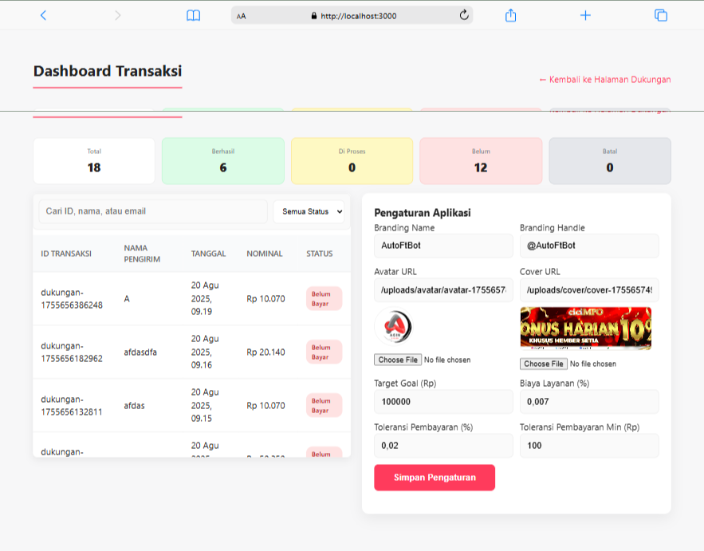
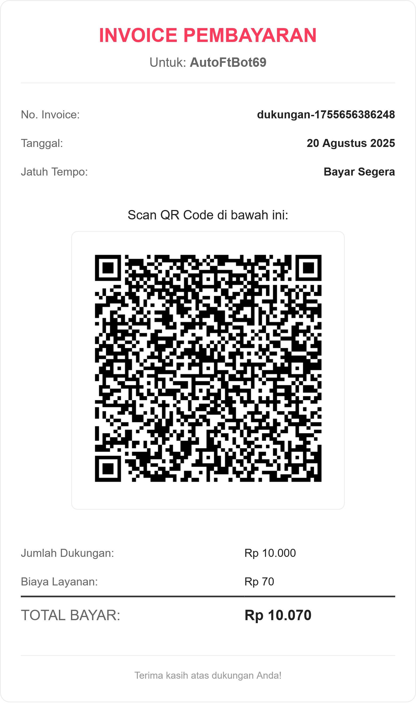

## Sawer — QRIS Donate (Powered by viaQris)

Proyek ini adalah turunan yang disesuaikan dari viaQris untuk menerima dukungan melalui QRIS dinamis, lengkap dengan dashboard admin, invoice siap unduh, dan konfigurasi branding langsung dari UI.

- **Demo**: [`https://donate.ftvpn.me`](https://donate.ftvpn.me)
- **Sample asal proyek**: [`awusahrul/viaQris`](https://github.com/awusahrul/viaQris)

### Tangkapan Layar

.png)



---

### Fitur Utama
- **QRIS Dinamis**: QR code unik per transaksi dengan nominal yang dipilih.
- **Dashboard Admin**: Monitoring transaksi, ubah status, dan pengaturan aplikasi.
- **Konfigurasi dari UI**: Branding name, handle, avatar, cover, target goal, fee, dan toleransi pembanding nominal pembayaran.
- **Invoice Siap Unduh**: Hasil PNG tajam (render html2canvas scale 3) dengan QR di tengah.
- **Upload Gambar**: Avatar/Cover bisa diunggah langsung dari dashboard (disimpan ke `public/uploads`).
- **Penyimpanan Data**: Menggunakan GitHub sebagai storage sederhana (gratis) via GitHub API.

---

### Prasyarat
- Node.js 18+ dan npm
- Repositori GitHub Private untuk menyimpan data transaksi
- GitHub Personal Access Token (classic) dengan scope `repo`
- String QRIS statis asli (akan diubah dinamis saat generate)

---

### Instalasi Lokal (Pengembangan)
1) Clone dan masuk ke direktori proyek
```bash
git clone https://github.com/AutoFTbot/Sawer.git
cd Sawer/viaQris
```

2) Pasang dependensi
```bash
npm install
```

3) Salin konfigurasi lingkungan
```bash
cp .env.example .env.local
# Lalu isi nilainya sesuai data Anda
```

4) Jalankan mode dev
```bash
npm run dev
# Buka http://localhost:3000
```

---

### Variabel Lingkungan (.env.local)
```ini
# Token GitHub dengan scope repo
GITHUB_TOKEN="ghp_xxx"

# Repo data private untuk menyimpan transaksi
REPO_OWNER="username-github-anda"
REPO_NAME="nama-repo-data-pribadi"  # misal: data-viaqris
BRANCH="main"
JSON_FILE_PATH="public/data.json"   # path file data di repo private

# String QRIS statis asli
DATA_STATIS_QRIS="PASTE_STRING_QRIS_STATIS_DI_SINI"

# Opsional (mutasi/cek pembayaran otomatis)
MUTASI_ENDPOINT="https://contoh.api/mutasi"
MUTASI_AUTH_USERNAME="username"
MUTASI_AUTH_TOKEN="token"

# Opsional (notifikasi Telegram)
TELEGRAM_BOT_TOKEN=""
TELEGRAM_CHAT_ID=""
```

Catatan: Sistem dashboard dan halaman utama juga membaca konfigurasi UI dari `public/data/viaQris.json` melalui endpoint `/api/config` (otomatis dibuat). Anda dapat mengubah branding dan parameter lain dari halaman dashboard.

---

### Jalur Halaman Penting
- Halaman utama: `/` — form dukungan, ringkasan, dan modal QRIS
- Dashboard admin: `/dash` — statistik, filter/pencarian, tabel transaksi, pengaturan aplikasi

---

### Cara Kerja Singkat
1) Pengguna memilih nominal → sistem membuat string QRIS dinamis (menyisipkan Tag 54 untuk nominal) → dirender menjadi gambar QR.
2) Data transaksi disimpan ke repo GitHub private (yang Anda set di env). File JSON di repo tersebut bertindak sebagai database sederhana.
3) Dashboard memuat data itu untuk ditampilkan dan dikelola. Anda bisa ubah status transaksi dan mengatur branding.
4) Invoice dibuat on-the-fly dan dapat diunduh sebagai PNG tajam.

---

### Build & Start Produksi (PM2)
```bash
# Di server
cd /path/to/Sawer/viaQris
npm install
npm run build

# Jalankan menggunakan PM2
pm2 start npm --name "viaqris" -- start

# Jika sudah pernah berjalan
pm2 restart viaqris
```

Jika muncul pesan "Could not find a production build in the '.next' directory", pastikan Anda menjalankan `npm run build` sebelum `npm start`.

---

### Upload Avatar & Cover
- Tersedia endpoint `POST /api/upload` (body: `{ dataUrl, kind: 'avatar'|'cover' }`).
- File disimpan ke `public/uploads/{avatar|cover}/...` dan URL otomatis terisi di pengaturan dashboard.

---

### Kredit
Proyek ini mengadaptasi konsep dan struktur dari repo open source: [`awusahrul/viaQris`](https://github.com/awusahrul/viaQris). Terima kasih untuk karya aslinya.

---

### Lisensi
MIT License.


